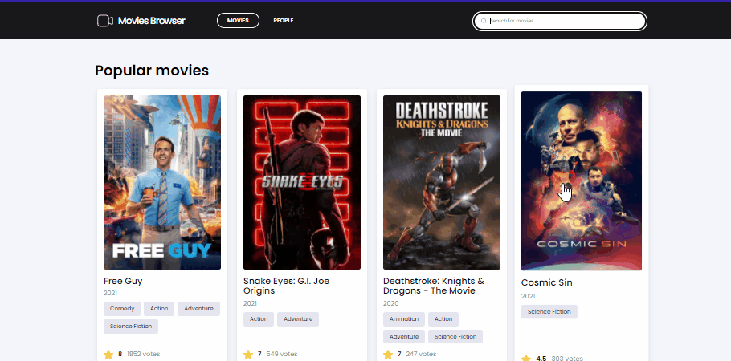
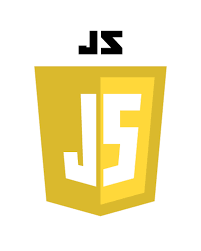
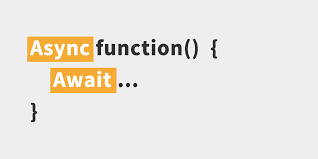
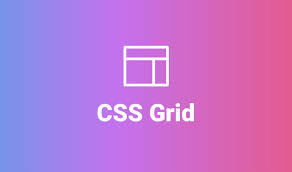
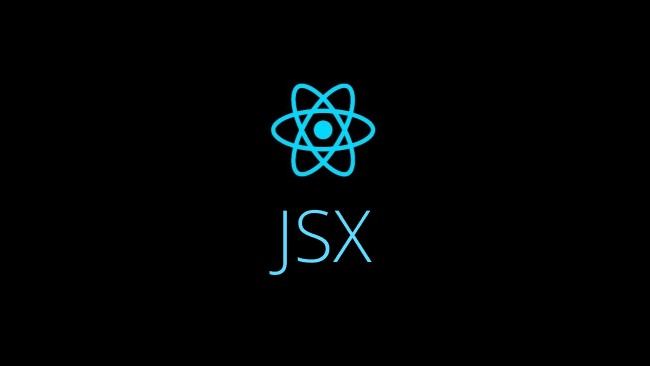

# :movie_camera: Movies Browser

## :computer: Demonstration

checkout [Demonstration](https://krzysztof-jaczewski.github.io/Movies-Browser/)

## :trophy: Authors :trophy:

### Created by:

- Paweł Suchy
- Evgeny Savelyev
- Krzysztof Jaczewski

## :milky_way: General

This is basic movie browser, where you can look, and serch your favourite films, actors and get more information about them. Site is using Api taken from TMDB, feel free to take a look and enjoy our creation🙂

## :scroll: Features

### :tv: Movies

Basic Page contains list of popular movies, we see numer of pages we can browse, on each page are up to 20 movies,

 

### :microscope: Movie Detalis

Every movie time you can click and browser will redirect you to this movie details where you can read more about it, and see what people took part in the creation this movie

 

### :dolls: People

The second page is people list, you can also browse the pages and look wich are popular

 

### :camera: Person Details

silmilar to movie details, you can click on every person you like and see move information about it, if some movie would interest you you can go directly to the next to it by clicking in his tile

 

### :mag_right: Search

And the final feature is search option, where you can seach your favourite movie just by tiping it title into input, and site will show all results that icnludes word you write, same thing you can do by changing page to peaple, Browser will be serching for person witch words you write

## :gear: Used Technologies

<table >
 <tr>
    <td>
    
    
 HTML

    </td>
    <td>
     
    
CSS

    </td>
    <td>
      
JavaScript

    </td>
 </tr>
 <tr>
    <td>
      
WebPack

    </td>
    <td>
    
    
Styled-components

    </td>
    <td>
    
    
 Axios

    </td>
 </tr>
 <tr>
    <td>
      
Creat-react-app

    </td>
    <td>
    
    
Immutability / Immer

    </td>
    <td>
    
    
JSON

    </td>
 </tr>
 <tr>
    <td>
    
    
Redux - Saga

    </td>
     <td>
     
    
 React / React Router

    </td>
    <td>
       
Hooks / customHooks

    </td>
 </tr>
 <tr>
  <td>
       
React-Redux

    </td>
    <td>
     
    
 Babel
</b>
    </td>
    <td>
     
ThemeProvider

    </td>
     <tr>
    <td>
     
    
Git, githubPages 

    </td>
    <td>
    
    
 Media queries

    </td>
    <td>
      
Async/await
</b>
    </td>
 </tr>
 <tr>
    <td>
    
     
 Flex

    </td>
    <td>
     
    
 Grid

    </td>
    <td>
    
    
JSX

    </td>
 </tr>
 </tr>
 
</table>

## :wrench: Available Scripts

In the project directory, you can run:

### `npm start`

Runs the app in the development mode.\
Open [http://localhost:3000](http://localhost:3000) to view it in the browser.

The page will reload if you make edits.\
You will also see any lint errors in the console.

### `npm run build`

Builds the app for production to the `build` folder.\
It correctly bundles React in production mode and optimizes the build for the best performance.

The build is minified and the filenames include the hashes.\
Your app is ready to be deployed!

See the section about [deployment](https://facebook.github.io/create-react-app/docs/deployment) for more information.

### `npm run eject`

**Note: this is a one-way operation. Once you `eject`, you can’t go back!**

If you aren’t satisfied with the build tool and configuration choices, you can `eject` at any time. This command will remove the single build dependency from your project.

Instead, it will copy all the configuration files and the transitive dependencies (webpack, Babel, ESLint, etc) right into your project so you have full control over them. All of the commands except `eject` will still work, but they will point to the copied scripts so you can tweak them. At this point you’re on your own.

You don’t have to ever use `eject`. The curated feature set is suitable for small and middle deployments, and you shouldn’t feel obligated to use this feature. However we understand that this tool wouldn’t be useful if you couldn’t customize it when you are ready for it.
